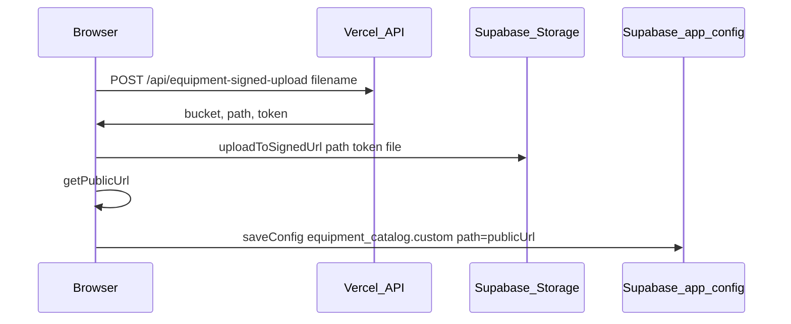

# Vercel, Supabase, and shared datasheet PDFs

This app shares **pricing/settings and the equipment datasheet catalog** across all users when Supabase is enabled. PDF **bytes** for team-wide uploads live in **Supabase Storage**; the catalog list (including HTTPS URLs) is stored in **`app_config`** JSON (`equipment_catalog`).

## 1. Supabase env on Vercel (client + config sync)

In the Vercel project → **Settings → Environment Variables**, set:

| Variable | Where it is used |
|----------|------------------|
| `VITE_SUPABASE_URL` | Browser: Supabase client, Storage `uploadToSignedUrl`, config sync |
| `VITE_SUPABASE_ANON_KEY` | Browser: anon/publishable key |

Redeploy after changing these (Vite inlines `VITE_*` at build time).

On first load with these set, [`AppContext`](src/context/AppContext.jsx) pulls remote `app_config` and quotations; [`saveConfig`](src/context/AppContext.jsx) persists the full config (including `equipment_catalog`) to Supabase.

## 2. Shared PDF uploads (Storage + Vercel `/api`)

Server-only variables (do **not** prefix with `VITE_`; never expose the service role to the client):

| Variable | Required | Description |
|----------|----------|-------------|
| `SUPABASE_URL` | Yes | Same project URL as `VITE_SUPABASE_URL` |
| `SUPABASE_SERVICE_ROLE_KEY` | Yes | Service role key (Dashboard → Settings → API) |
| `EQUIPMENT_STORAGE_BUCKET` | No | Default `equipment-datasheets` |
| `EQUIPMENT_UPLOAD_API_KEY` | Recommended | If set, client must send matching `VITE_EQUIPMENT_UPLOAD_API_KEY` |

Optional client overrides:

| Variable | Description |
|----------|-------------|
| `VITE_EQUIPMENT_STORAGE_BUCKET` | Must match bucket name if not default |
| `VITE_EQUIPMENT_UPLOAD_API_KEY` | Same value as `EQUIPMENT_UPLOAD_API_KEY` when that is set |
| `VITE_API_ORIGIN` | e.g. `https://your-app.vercel.app` — use when running `npm run dev` locally but calling production APIs |

### Supabase Storage setup

1. In Supabase **Storage**, create a bucket named `equipment-datasheets` (or your `EQUIPMENT_STORAGE_BUCKET`).
2. Mark the bucket **public** so proposal PDF generation can `fetch()` datasheets without auth.
3. No anon `insert` policy is required for browser uploads: the flow uses a **signed upload URL** minted by the Vercel function with the **service role**.

SQL policies (run in SQL editor if you prefer SQL over the UI) — adjust bucket id if needed:

```sql
-- Allow public read of objects (public bucket often sets this automatically)
insert into storage.buckets (id, name, public)
values ('equipment-datasheets', 'equipment-datasheets', true)
on conflict (id) do update set public = excluded.public;
```

If the bucket already exists, ensure **Public bucket** is enabled in the Dashboard.

## 3. Local development

- **Same machine, full stack:** run `vercel dev` from the repo root so `/api/equipment-signed-upload` and `/api/equipment-storage-delete` run with server env vars (e.g. `.env.local` on the Vercel CLI side).
- **Vite only (`npm run dev`):** set `VITE_API_ORIGIN=https://<your-preview-or-prod>.vercel.app` so the browser calls deployed `/api/*`, **or** set `VITE_VERCEL_DEV_API=http://localhost:3000` (or whatever host `vercel dev` prints) in `.env.local` to **proxy** `/api` through Vite (see [`vite.config.js`](vite.config.js)).

## 4. Operational checklist

- [ ] `VITE_SUPABASE_URL` + `VITE_SUPABASE_ANON_KEY` on Vercel, redeployed  
- [ ] `SUPABASE_URL` + `SUPABASE_SERVICE_ROLE_KEY` on Vercel (server)  
- [ ] Storage bucket exists, **public**, name matches env  
- [ ] Optional: set `EQUIPMENT_UPLOAD_API_KEY` / `VITE_EQUIPMENT_UPLOAD_API_KEY` to reduce abuse of upload/delete endpoints  
- [ ] Git path datasheets (`panels/foo.pdf`) still require the file under `public/SYSTEM EQUIPMENTS/` and a deploy  

## 5. Flow summary


